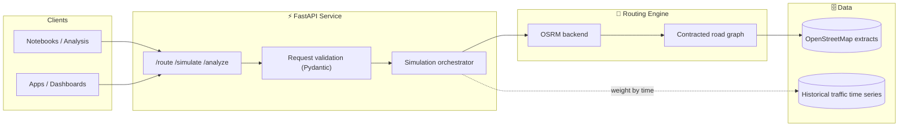
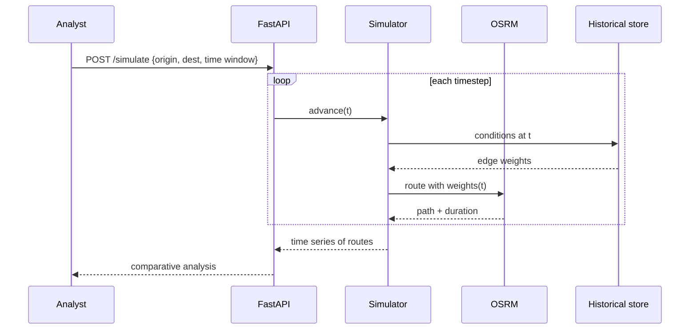
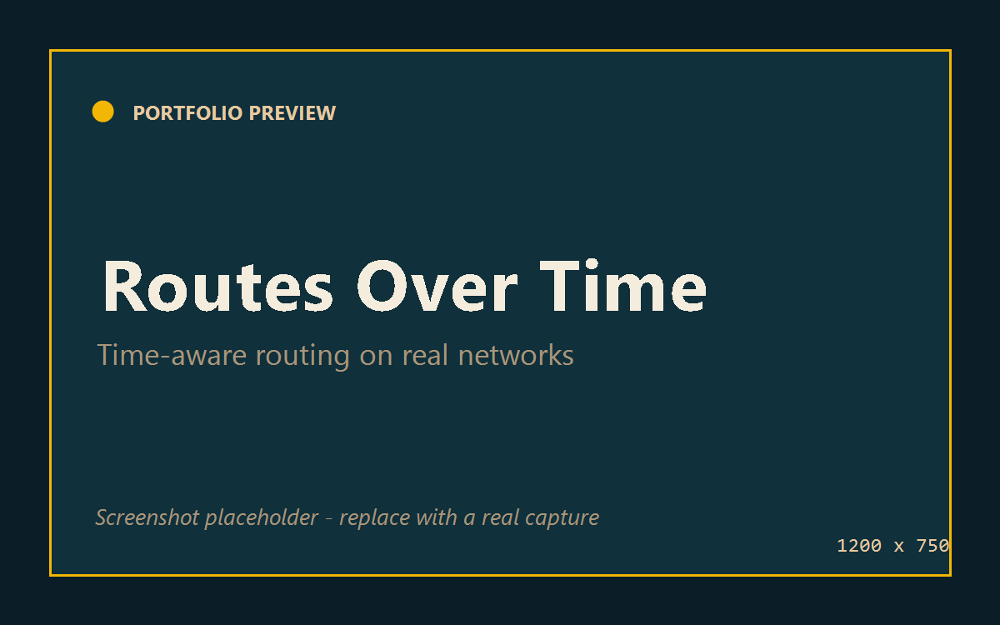
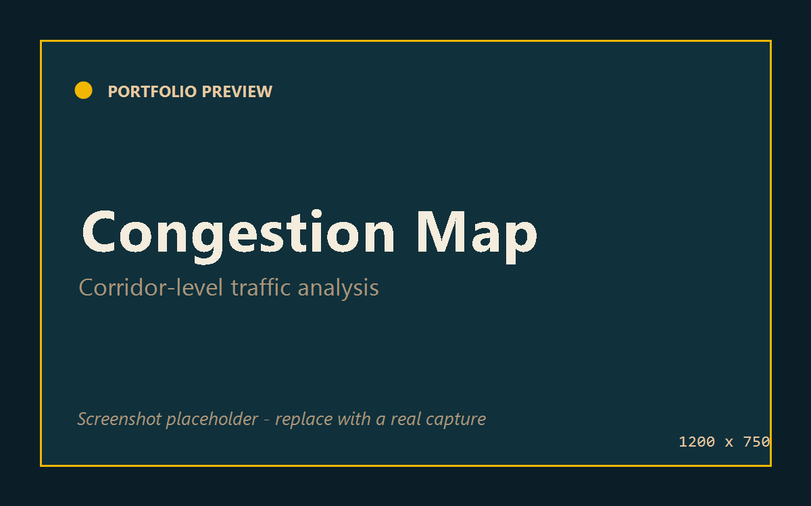
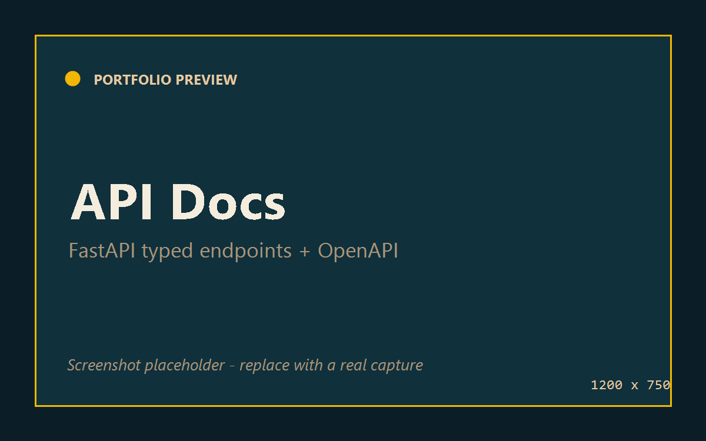

<div align="center">

# 🛰 Historical Traffic Routing Platform

### Time-aware routing & simulation over real road networks.

*What was the fastest route at 8:15 AM last Tuesday? This platform answers questions a live router can't.*

[](#-development-status)


</div>

> **Public portfolio repository.** Architecture, design, and roadmap are open; core implementation is private. Code walkthrough available under NDA — **arasghorbani9090@gmail.com**.

---

## 📖 Overview

Most routing engines answer one question: *"What's the fastest way right now?"* But planners, researchers, and logistics teams need a different one: *"What did traffic actually do over time, and how would different routes have performed?"*

The **Historical Traffic Routing Platform** layers **time** onto routing. It replays historical road-network conditions through an OSRM engine built on OpenStreetMap, so you can compute routes *as they would have been* at any point in a time series — then simulate, compare, and analyze them at scale.

**Use cases**
- 📊 **Traffic analysis** — quantify congestion patterns across hours, days, and corridors.
- 🚚 **Fleet & logistics planning** — evaluate routing strategies against real historical conditions.
- 🧪 **Routing research** — A/B route policies on reproducible, time-stamped network states.

---

## ✨ Features

- ⏱ **Historical routing** — compute routes against road-network conditions at a chosen timestamp, not just live state.
- 🔁 **Simulation framework** — replay journeys across time windows to study how route choice and travel time evolve.
- 🗺 **OSM-native** — built directly on OpenStreetMap data, so coverage extends anywhere OSM does.
- 🚀 **OSRM core** — fast shortest-path computation over contracted road graphs.
- 🌐 **Clean FastAPI service** — typed, documented HTTP API with automatic OpenAPI docs.
- 📈 **Analysis outputs** — structured route + timing data ready for notebooks and dashboards.

---

## 🏗 Architecture



### Simulation flow



---

## 🧱 Tech Stack

| Layer | Technology |
| --- | --- |
| **API** | FastAPI, Pydantic, Uvicorn |
| **Routing** | OSRM (Open Source Routing Machine) |
| **Map data** | OpenStreetMap extracts |
| **Language** | Python 3.11+ |
| **Analysis** | NumPy / Pandas-friendly structured outputs |
| **Packaging** | Docker (OSRM + service) |

---

## 📂 Folder Structure

> Representative — illustrative of organization, not a source dump.

```
historical-traffic-routing/
├── app/
│   ├── api/                # FastAPI routers: route, simulate, analyze
│   ├── core/               # config, settings
│   ├── routing/            # OSRM client + graph weighting
│   ├── simulation/         # time-stepped replay engine
│   └── schemas/            # Pydantic request/response models
├── data/
│   ├── osm/                # OpenStreetMap extracts & build artifacts
│   └── historical/         # time-series traffic conditions
├── notebooks/              # analysis & validation
└── docker/                 # OSRM + service compose
```

---

## 🖼 Screenshots

> Placeholders — add captures to `docs/screenshots/`.

| Route over time | Congestion heatmap | API docs |
| --- | --- | --- |
|  |  |  |

---

## 🗺 Roadmap

- [x] OSRM + OSM routing core
- [x] FastAPI service with typed endpoints
- [x] Time-stepped simulation framework
- [ ] Historical condition ingestion pipeline (batch + streaming)
- [ ] Corridor-level congestion analytics
- [ ] Scenario comparison API (policy A vs B)
- [ ] Caching layer for repeated time-window queries
- [ ] Hosted demo + sample datasets

---

## 📈 Development Status

🟡 **Active R&D** — routing core and simulation framework are functional; current work is on historical-data ingestion and analytics surfaces.

---

## 🤝 Contact

📧 **arasghorbani9090@gmail.com** · 🔗 [LinkedIn](https://www.linkedin.com/in/arasghorbani)

<div align="center"><sub>Public architecture & docs. Implementation is proprietary.</sub></div>
